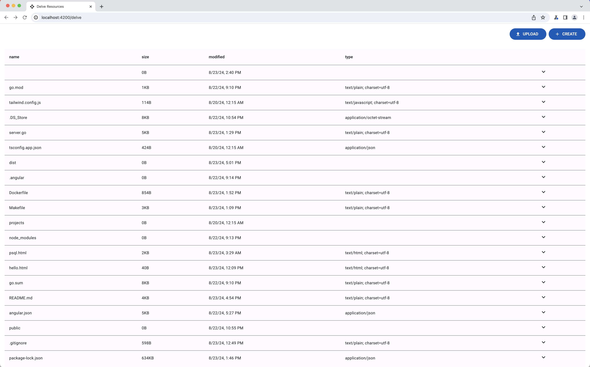
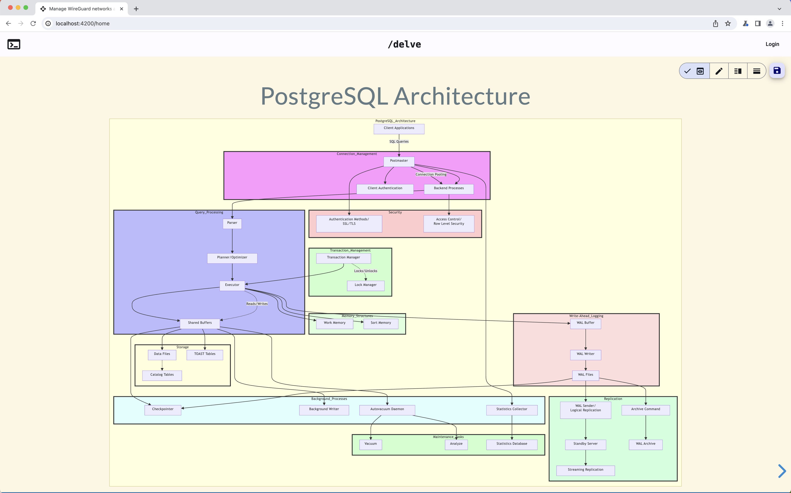
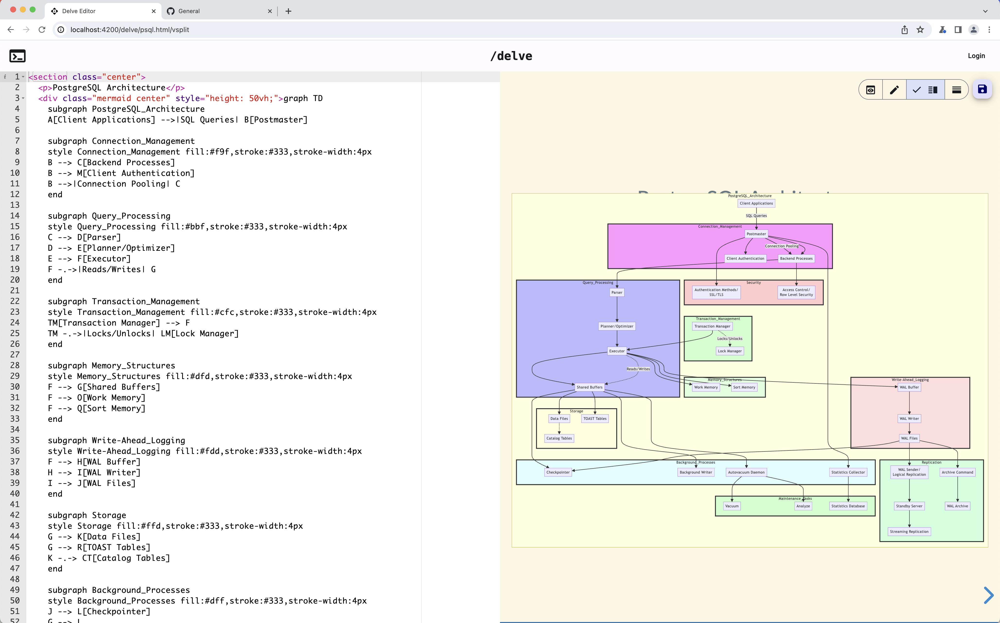
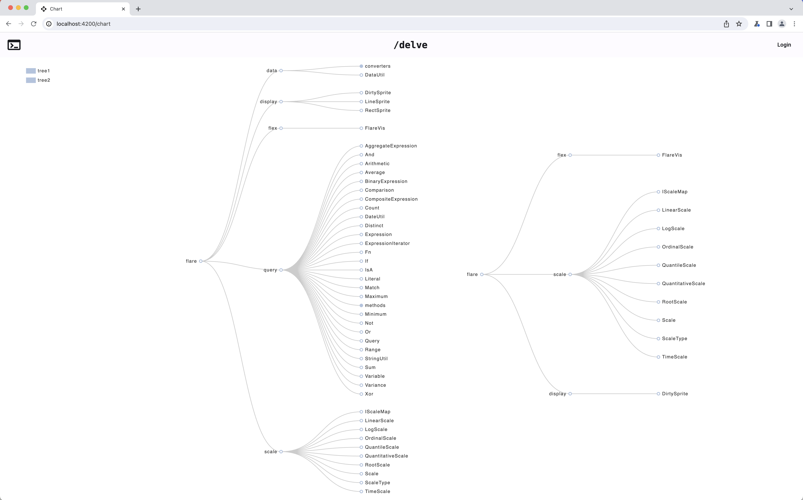

# `delve`: for developers to create/share slides, charts in plain text

## Built with
- [reveal.js](https://revealjs.com/) for slides with markdown,mermaid etc supported by reveal itself
- [echarts](https://echarts.apache.org) using [ngx-echarts](https://xieziyu.github.io/ngx-echarts/) for charts
- [ace](https://github.com/ajaxorg/ace) for code editor
- [Angular](https://angular.io) for frontend

## let's `delve` in

```shell
git clone https://github.com/edgeflare/delve.git && cd delve
npm install && npx ng build ng-essential
go mod tidy
go run .
npx ng serve
```

|                                                          |                                                   |
|----------------------------------------------------------|---------------------------------------------------|
|    |   |
|  |     |

## WebDAV Server

This is a simple Go WebDAV server implementation using the `golang.org/x/net/webdav` package. The `edgeflare/pgo/middleware` package is used to provide middleware for request ID, CORS, and logging.

* Serves files from the `.` directory. supply the `--dir` flag to specify a different directory.
* Supports basic WebDAV operations (see below).
* Includes middleware for request ID generation, CORS handling, and logging.

### Common WebDAV Methods (not all implemented in UI, yet)

| Method | Description | Example |
|---|---|---|
| `PROPFIND` | Retrieves properties of a resource or collection. | `curl -X PROPFIND -H "Depth: 1" http://localhost:8080/webdav/` |
| `GET` | Retrieves the content of a file. | `curl http://localhost:8080/webdav/filename.txt` |
| `PUT` | Uploads or modifies a file. | `echo 'helloworld' > newfile.txt && curl -T newfile.txt http://localhost:8080/webdav/newfile.txt` |
| `MKCOL` | Creates a new collection (directory). | `curl -X MKCOL http://localhost:8080/webdav/newdirectory/` |
| `DELETE` | Deletes a file or collection. | `curl -X DELETE http://localhost:8080/webdav/file-to-delete.txt` |
| `MOVE` | Moves or renames a file or collection. | `curl -X MOVE -H "Destination: http://localhost:8080/webdav/newname.txt" http://localhost:8080/webdav/oldname.txt` |
| `COPY` | Copies a file or collection. | `curl -X COPY -H "Destination: http://localhost:8080/webdav/copy-of-file.txt" http://localhost:8080/webdav/original-file.txt` |
| `LOCK` | Obtains a lock on a resource. | `curl -X LOCK -H "Timeout: Infinite" http://localhost:8080/webdav/file-to-lock.txt` |
| `UNLOCK` | Releases a lock on a resource. | `curl -X UNLOCK -H "Lock-Token: <lock-token>" http://localhost:8080/webdav/file-to-unlock.txt` |

**Note:** Replace placeholders like `<lock-token>` with actual values.


## Development/Contributing
If you're reading this, you probably hate MS Office and the likes. I decided to spend a weekend to bring the above tools in one place with a webdav fileserver. It has basic-auth, keyboard shortcuts for saving, switching preview, edit, and split view. Feel free to chip-in.
